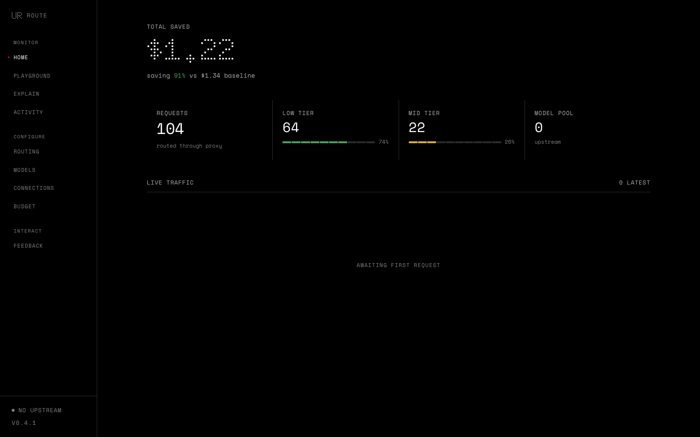

<p align="right"><strong>English</strong> | <a href="https://github.com/CommonstackAI/UncommonRoute/blob/main/README.zh-CN.md">简体中文</a></p>

<div align="center">

<h1>UncommonRoute</h1>

**Cut your LLM costs by 82% with automatic model routing.**

Most of your LLM budget goes to simple tasks that don't need a premium model.
UncommonRoute picks the cheapest model that still gets the job done — automatically.

<br>

<a href="https://pypi.org/project/uncommon-route/"></a>
<a href="https://www.npmjs.com/package/@anjieyang/uncommon-route"></a>
<a href="https://python.org"></a>
<a href="LICENSE"></a>

</div>

<br>

<p align="center">
  
</p>

<div align="center">

**[Quick Start](#quick-start)** · **[How It Works](#how-it-works)** · **[Benchmarks](#benchmarks)** · **[Dashboard](#dashboard)** · **[Configuration](#configuration)**

</div>

---

## Quick Start

### 1. Install

```bash
pip install uncommon-route
```

### 2. Run the guided setup

```bash
uncommon-route init
```

The wizard walks you through:

- choosing a connection path: Commonstack, local/custom upstream, or BYOK
- saving upstream credentials locally
- configuring Claude Code, Codex, or OpenAI SDK / Cursor
- optionally starting the proxy in background

If you prefer to sanity-check before starting the proxy:

```bash
uncommon-route doctor
```

### 3. Point your client at the proxy

| Client | Change |
|---|---|
| Claude Code | `export ANTHROPIC_BASE_URL="http://localhost:8403"` |
| Codex / Cursor / OpenAI SDK | `export OPENAI_BASE_URL="http://localhost:8403/v1"` |
| OpenClaw | Plugin — see [openclaw.ai](https://openclaw.ai) |

Then use `uncommon-route/auto` as the model ID:

```python
client = OpenAI(base_url="http://localhost:8403/v1")
resp = client.chat.completions.create(model="uncommon-route/auto", messages=msgs)
# → simple tasks → cheap model, complex tasks → premium model
```

Works with **Claude Code**, **Codex**, **Cursor**, the **OpenAI SDK**, and **OpenClaw**.

<details>
<summary><strong>Manual setup (advanced)</strong></summary>

**Commonstack managed upstream**

```bash
export UNCOMMON_ROUTE_UPSTREAM="https://api.commonstack.ai/v1"
export UNCOMMON_ROUTE_API_KEY="csk-your-key"
uncommon-route serve
```

One key gives you OpenAI, Anthropic, Google, xAI, MiniMax, Moonshot, DeepSeek, and more — consolidated billing, no per-provider setup.

**Bring your own keys (BYOK)**

```bash
uncommon-route provider add openai     sk-...
uncommon-route provider add anthropic  sk-ant-...
uncommon-route provider add google     AIza...
# also supported: xai, minimax, moonshot, deepseek
uncommon-route serve
```

Auto-routing will only consider models backed by a registered provider.

> **Note:** UncommonRoute does **not** auto-read `OPENAI_API_KEY` / `ANTHROPIC_API_KEY`. Use `uncommon-route init`, a saved connection, or one of the manual paths above.

</details>

---

## How It Works

Every request is analyzed by three independent signals, then routed to the cheapest capable model:

```
"hello"                              → 🟢 nano         $0.0008
"fix the typo on line 3"             → 🟢 deepseek     $0.0012
"refactor this 500-line module"      → 🟠 sonnet       $0.0337
"design a distributed scheduler"     → 🔴 opus         $0.0562
```

| Signal | What it does | Speed (CPU, warm) |
|---|---|---|
| **Metadata** | Conversation structure, tool usage, depth | <1ms |
| **Embedding** | Semantic similarity to known task patterns (bge-small) | ~20ms |
| **Structural** | Text complexity features (shadow mode) | <1ms |

End-to-end `route()` overhead on a warm process is **~20–25ms** (dominated by the embedding signal). Cold start is a few hundred ms for the first request. GPU or a cached embedding path can bring this under 5ms; benchmark with `scripts/bench_overhead.py`.

Signals vote. The ensemble picks the tier. The router selects the cheapest model in that tier. If uncertain, it leans conservative — better to spend a little more than to fail the task.

**It gets smarter over time.** Signal weights adjust from routing outcomes. The embedding index grows with usage. Low-confidence predictions automatically escalate.

---

## Why v2

Our v1 classifier hit 88.5% accuracy on clean benchmark data. We shipped it.

Then we tested on real agent conversations — multi-turn, tool-calling, messy context — and accuracy dropped to 43%. More than half the routing decisions were wrong.

We didn't patch it. We rebuilt from scratch.

| | v1 | v2 |
|---|---|---|
| **Accuracy** | 43% | **78%** |
| **Task pass rate** | 100% (cheated — always chose most expensive) | **93.4%** (real routing) |
| **Cost savings** | 0% | **82%** |

We're telling you this because we'd rather you trust our numbers than be impressed by them.

---

## Benchmarks

Tested on [CommonRouterBench](https://github.com/CommonstackAI/CommonRouterBench) — 970 real agent task traces across SWE-Bench, BFCL, MT-RAG, QMSum, and PinchBench. All numbers measured end-to-end through the production code path.

| Metric | Value |
|---|---|
| **Cost savings** | **82%** vs always-premium |
| **Task pass rate** | **93.4%** |
| **Routing overhead** | **~20–25ms** (warm process, CPU, bge-small embedding) |
| **Accuracy** | **78%** tier match |

```bash
python scripts/eval_v2.py  # reproduce it yourself
```

---

## Dashboard

```bash
uncommon-route serve
# → http://localhost:8403/dashboard/
```

Real-time monitoring, interactive playground, cost tracking, and model routing configuration — all in a Nothing Design-inspired interface.

---

## Diagnostics

When a user hits a routing or upstream issue, you can export a local support bundle without guessing which logs to collect:

```bash
uncommon-route support bundle
uncommon-route support request <request_id>
```

The bundle includes recent request traces, recent errors, stats summaries, provider/config snapshots, and redacted local state. It stays on your machine until you choose to share it.

---

## Configuration

### Routing modes

| Mode | Model ID | Behavior |
|---|---|---|
| **auto** | `uncommon-route/auto` | Balanced — best quality-per-dollar |
| **fast** | `uncommon-route/fast` | Cost-first — cheapest acceptable |
| **best** | `uncommon-route/best` | Quality-first — strongest available |

### Spend limits

```bash
uncommon-route spend set daily 20.00
uncommon-route spend status
```

### Managing providers

```bash
uncommon-route provider list
uncommon-route provider add <name> <api-key>
uncommon-route provider remove <name>
```

Supported names: `commonstack`, `openai`, `anthropic`, `google`, `xai`, `minimax`, `moonshot`, `deepseek`. See [Quick Start](#quick-start) for the two setup paths (managed upstream vs. BYOK).

<details>
<summary><strong>All environment variables</strong></summary>

| Variable | Meaning |
|---|---|
| `UNCOMMON_ROUTE_UPSTREAM` | Upstream base URL for the managed path (e.g. `https://api.commonstack.ai/v1`). Ignored in BYOK mode. |
| `UNCOMMON_ROUTE_API_KEY` | API key paired with `UNCOMMON_ROUTE_UPSTREAM`. Not a fallback for per-provider keys. |
| `UNCOMMON_ROUTE_PORT` | Local proxy port (default 8403) |

</details>

---

## Privacy

Runs entirely on your machine. No data leaves unless you opt in.

```bash
uncommon-route telemetry status
```

Diagnostics exports are also local-first: `uncommon-route support bundle` writes a redacted zip under `~/.uncommon-route/support/` by default.

---

## Development

```bash
git clone https://github.com/CommonstackAI/UncommonRoute.git
cd UncommonRoute && pip install -e ".[dev]"
python -m pytest tests -v
```

---

## License

MIT — see [LICENSE](LICENSE).
