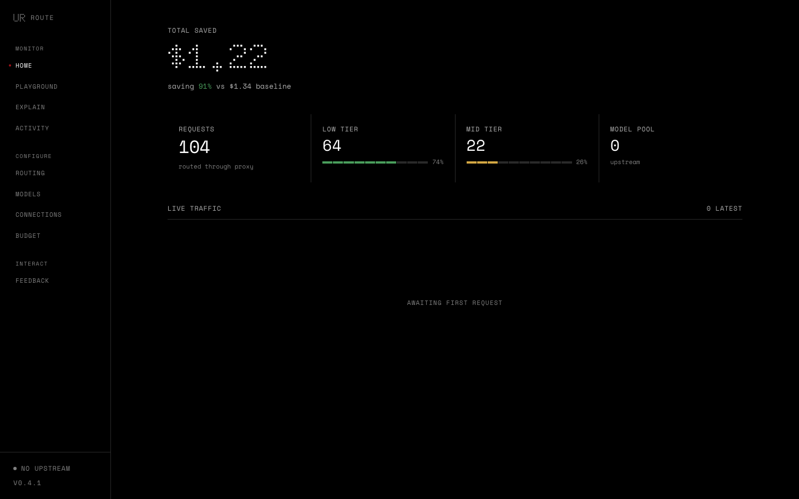

<p align="right"><a href="https://github.com/CommonstackAI/UncommonRoute/blob/main/README.md">English</a> | <strong>简体中文</strong></p>

<div align="center">

<h1>UncommonRoute</h1>

**自动模型路由，降低 LLM 开销。**

大部分 LLM 预算都花在了不需要顶配模型的简单任务上。
UncommonRoute 自动选最便宜、又能完成任务的模型。

当前 held-out 评测：CommonRouterBench 上 **91.8% 任务完成率**，**81.9 成本节省分数**。

<br>

<a href="https://pypi.org/project/uncommon-route/"></a>
<a href="https://www.npmjs.com/package/@anjieyang/uncommon-route"></a>
<a href="https://python.org"></a>
<a href="LICENSE"></a>

</div>

<br>

<p align="center">
  
</p>

<div align="center">

**[快速开始](#快速开始)** · **[工作原理](#工作原理)** · **[性能数据](#性能数据)** · **[Dashboard](#dashboard)** · **[配置](#配置)**

</div>

---

## 快速开始

### 1. 安装

```bash
pipx install uncommon-route
```

对大多数 CLI 用户来说，`pipx` 是更好的默认方案：它会把 UncommonRoute 安装到独立环境里，不污染系统 Python，卸载也更干净。

普通安装已经包含训练好的 v2 runtime assets 和 embedding 依赖。生产路由不需要再额外安装 `[v2]`。

如果你还没有安装 `pipx`，优先使用系统包管理器安装会更稳妥，比如 macOS 上用 `brew install pipx`，较新的 Ubuntu 用 `sudo apt install pipx`，Fedora 用 `sudo dnf install pipx`，然后执行 `pipx ensurepath`。

如果系统里没有现成的 `pipx` 包，再参考 [pipx 官方安装文档](https://pipx.pypa.io/stable/installation/) 或直接运行：

```bash
python3 -m pip install --user pipx
python3 -m pipx ensurepath
```

如果你本来就在虚拟环境里工作，用 `pip` 也完全可以：

```bash
python3 -m pip install uncommon-route
```

<details>
<summary><strong>安装排障：什么时候用 pip，什么时候用 pipx</strong></summary>

- 如果你是在安装一个平时直接在终端里用的 CLI 工具，优先用 `pipx install uncommon-route`。
- 如果你已经在某个项目的虚拟环境里，直接在那个环境里运行 `python -m pip install uncommon-route`。
- 如果你不确定 `pip` 指向哪个 Python，优先写成 `python3 -m pip ...`，这样不会装到错误的解释器里。
- 如果你的系统 Python 报了 “externally managed environment” 之类的错误，不要强行往系统环境里装，改用 `pipx` 或虚拟环境。
- 如果你必须绑定某个 Python 版本，`pipx` 也可以直接指定，比如：`pipx install --python python3.12 uncommon-route`。

</details>

### 2. 运行引导式配置

```bash
uncommon-route init
```

这个向导会一步步帮你：

- 选择接入方式：Commonstack、BYOK，或者本地 / 自定义 upstream
- 把 upstream 凭据保存到本地
- 配置 Claude Code、Codex、OpenAI SDK / Cursor
- 可选地直接把代理以后台方式启动起来

如果你想在启动前先检查一遍：

```bash
uncommon-route doctor
```

### 3. 把客户端指向代理

| 客户端 | 改动 |
|---|---|
| Claude Code | `export ANTHROPIC_BASE_URL="http://localhost:8403"` 和 `export ANTHROPIC_AUTH_TOKEN="not-needed"` |
| Codex / Cursor / OpenAI SDK | `export OPENAI_BASE_URL="http://localhost:8403/v1"` |
| OpenClaw | 插件接入——详见 [openclaw.ai](https://openclaw.ai) |

然后把模型 ID 设为 `uncommon-route/auto`：

```python
client = OpenAI(base_url="http://localhost:8403/v1")
resp = client.chat.completions.create(model="uncommon-route/auto", messages=msgs)
# → 简单任务走便宜模型，复杂任务走顶配模型
```

支持 **Claude Code**、**Codex**、**Cursor**、**OpenAI SDK** 和 **OpenClaw**。

<details>
<summary><strong>手动配置（进阶）</strong></summary>

**方式 A — Commonstack 托管（推荐，一把 key 覆盖所有 provider）**

```bash
export UNCOMMON_ROUTE_UPSTREAM="https://api.commonstack.ai/v1"
export UNCOMMON_ROUTE_API_KEY="csk-your-key"
uncommon-route serve
```

一把 key 打通 OpenAI、Anthropic、Google、xAI、MiniMax、Moonshot、DeepSeek 等所有主流 provider——统一账单，无需逐家申请。

**方式 B — 自带 key（BYOK）**

```bash
uncommon-route provider add openai     sk-...
uncommon-route provider add anthropic  sk-ant-...
uncommon-route provider add google     AIza...
# 同样支持：xai、minimax、moonshot、deepseek
uncommon-route serve
```

Auto 路由只会在已注册的 provider 范围内选模型。

> **注意：** UncommonRoute **不会**自动读取 `OPENAI_API_KEY` / `ANTHROPIC_API_KEY` 环境变量。请使用 `uncommon-route init`、本地保存的连接配置，或上面的手动方式。

</details>

---

## 工作原理

每个请求会先经过多个本地信号分析，然后路由到你配置的 upstream 里最便宜的合适模型：

```
"你好"                     → economy tier
"修一下第 3 行的拼写错误"   → economy / balanced tier
"重构这个 500 行的模块"    → balanced / premium tier
"设计一个分布式调度系统"    → premium tier
```

具体模型 ID 和价格来自当前 upstream 的模型目录以及你的本地配置。UncommonRoute 不依赖单一写死的模型列表。

| 信号 | 分析内容 | 耗时 |
|---|---|---|
| **元数据信号** | 对话轮次、工具调用、上下文深度 | <1ms |
| **语义信号** | 基于 BGE 的训练分类器，结合用户请求、最近 agent 状态和元数据；不确定时回退到 KNN | warm route 端到端约 ~25–35ms |
| **结构信号** | 文本和对话复杂度；部分请求直接参与，其他请求以 shadow 方式追踪 | <1ms |

warm process 上，端到端 `route()` 开销通常是 **~25–35ms**（CPU），主要来自语义信号。冷启动需要加载 embedding 模型，在全新进程或新机器上可能需要数秒；预热后路由都在本地完成。

多个信号投票，集成模型决定 tier。随后路由器会在满足 tier、能力、协议和 upstream 可用性约束的模型中选择最低成本的模型。未知价格或动态价格会被保守处理，不会被当成真实负价格。

路由是 **per request / per agent step** 的，不会把整个 session 锁死在同一个模型上。只有协议本身要求连续性的场景才会加约束，比如 Anthropic thinking continuation。

**越用越准。** 本地反馈可以调整信号权重，高置信度一致判断可以扩展 embedding index，低置信度预测会升级，而不是静默降到不合适的模型。

---

## 为什么做 v2

v1 分类器在干净的 benchmark 上跑出了 88.5% 的准确率，我们直接上了线。

然后拿真实的 Agent 对话一测——多轮交互、工具调用、上下文乱七八糟——准确率直接掉到 43%。超过一半的路由决策是错的。

我们没有选择打补丁，而是从零开始重写。

| | v1 | v2 |
|---|---|---|
| **Tier match 准确率** | 43% | **74.0%** held-out |
| **任务完成率** | 100%（作弊——永远选最贵的） | **91.8%**（真正的路由决策） |
| **成本节省分数** | 0% | **81.9** |

我们把这些数据告诉你，是因为比起让你被数字震撼到，我们更希望你能信任它。

---

## 性能数据

基于 [CommonRouterBench](https://github.com/CommonstackAI/CommonRouterBench) 测试——970 条真实 Agent 任务轨迹，覆盖 SWE-Bench、BFCL、MT-RAG、QMSum 和 PinchBench。下面的公开数字使用 196 条 held-out split，不包含训练集和 calibration 集。

| 指标 | 数值 |
|---|---|
| **任务完成率** | **91.8%** |
| **Tier match 准确率** | **74.0%** |
| **成本节省分数** | **81.9**（对比全程顶配 baseline） |
| **综合分数** | **76.7** |
| **warm 路由延迟** | 本地 CPU 运行 **p50 25.6ms / p90 32.1ms** |

```bash
python -m pip install -e ".[dev]"
python -m pip install "git+https://github.com/CommonstackAI/CommonRouterBench.git"
python scripts/eval_v2.py --split holdout
python scripts/bench_overhead.py --iterations 50 --json
```

---

## Dashboard

```bash
uncommon-route serve
# → http://localhost:8403/dashboard/
```

实时监控、交互式 Playground、成本追踪、路由配置——采用 Nothing Design 风格的深色界面。

---

## 诊断与排障

如果用户遇到路由异常、上游报错，或者某次请求行为不对，现在可以直接导出本地诊断包，不需要先猜该收集哪些日志：

```bash
uncommon-route support bundle
uncommon-route support request <request_id>
```

诊断包会包含最近请求 trace、最近错误、统计摘要、provider / 配置快照，以及脱敏后的本地状态。默认只写到你的本机，只有你主动分享时才会离开电脑。

---

## 停用与卸载

停止代理服务：

- 前台运行时：在运行 `uncommon-route serve` 的终端里按 `Ctrl+C`
- 后台 daemon：运行 `uncommon-route stop`
- 查看后台日志：运行 `uncommon-route logs --follow`

如果你不想让客户端继续走 UncommonRoute，把 `uncommon-route init` 写进 shell rc 的那段配置删掉或注释掉即可。这个文件通常是 `~/.zshrc`、`~/.bashrc` 或 `~/.config/fish/config.fish`。改完后重开终端；如果只想让当前 shell 立刻失效，也可以直接执行：

```bash
unset OPENAI_BASE_URL OPENAI_API_KEY ANTHROPIC_BASE_URL ANTHROPIC_AUTH_TOKEN ANTHROPIC_API_KEY
```

卸载包本身：

```bash
pipx uninstall uncommon-route
# 如果你是用 pip 装到某个特定环境里的：
python3 -m pip uninstall uncommon-route
```

如果你还想把本地状态一起删掉，再移除 `~/.uncommon-route/` 即可。这个目录里包含保存的连接信息、provider key、日志、trace 和诊断包。

---

## 配置

### 路由模式

| 模式 | 模型 ID | 行为 |
|---|---|---|
| **auto** | `uncommon-route/auto` | 平衡——最佳性价比 |
| **fast** | `uncommon-route/fast` | 省钱优先——最便宜的能用的 |
| **best** | `uncommon-route/best` | 质量优先——用最强模型 |

### 花费控制

```bash
uncommon-route spend set daily 20.00
uncommon-route spend status
```

### Provider 管理

```bash
uncommon-route provider list
uncommon-route provider add <name> <api-key>
uncommon-route provider remove <name>
```

支持的 provider 名：`commonstack`、`openai`、`anthropic`、`google`、`xai`、`minimax`、`moonshot`、`deepseek`。两种接入模式（托管上游 vs. BYOK）详见 [快速开始](#快速开始)。

<details>
<summary><strong>所有环境变量</strong></summary>

| 变量 | 含义 |
|---|---|
| `UNCOMMON_ROUTE_UPSTREAM` | 托管上游模式的 base URL（例如 `https://api.commonstack.ai/v1`）。BYOK 模式下忽略。 |
| `UNCOMMON_ROUTE_API_KEY` | 与 `UNCOMMON_ROUTE_UPSTREAM` 配对的 API key。不会作为各 provider key 的兜底。 |
| `UNCOMMON_ROUTE_PORT` | 本地代理端口（默认 8403） |

</details>

---

## 隐私

完全在本地运行，除非你主动选择分享，否则不会有任何数据离开你的电脑。

```bash
uncommon-route telemetry status
```

`uncommon-route support bundle` 生成的诊断包默认也只会保存在 `~/.uncommon-route/support/`。

---

## 开发

```bash
git clone https://github.com/CommonstackAI/UncommonRoute.git
cd UncommonRoute && pip install -e ".[dev]"
python -m pytest tests -v
```

---

## 许可证

MIT——详见 [LICENSE](LICENSE)。
